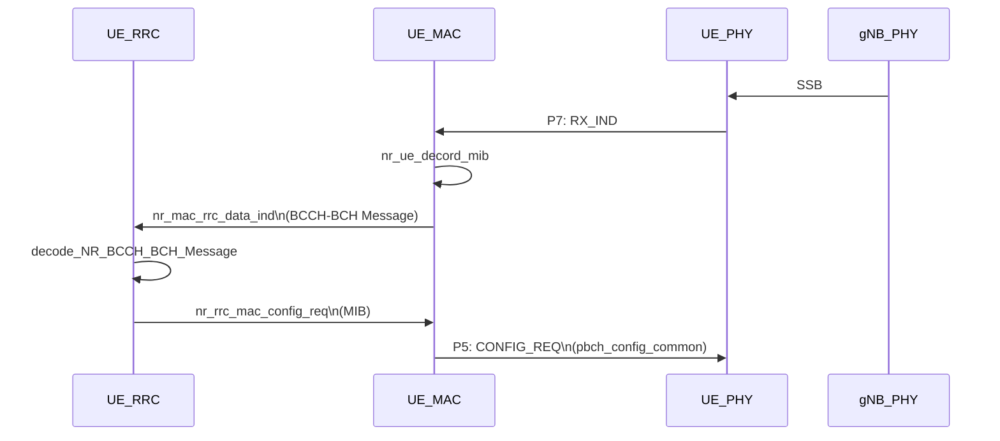
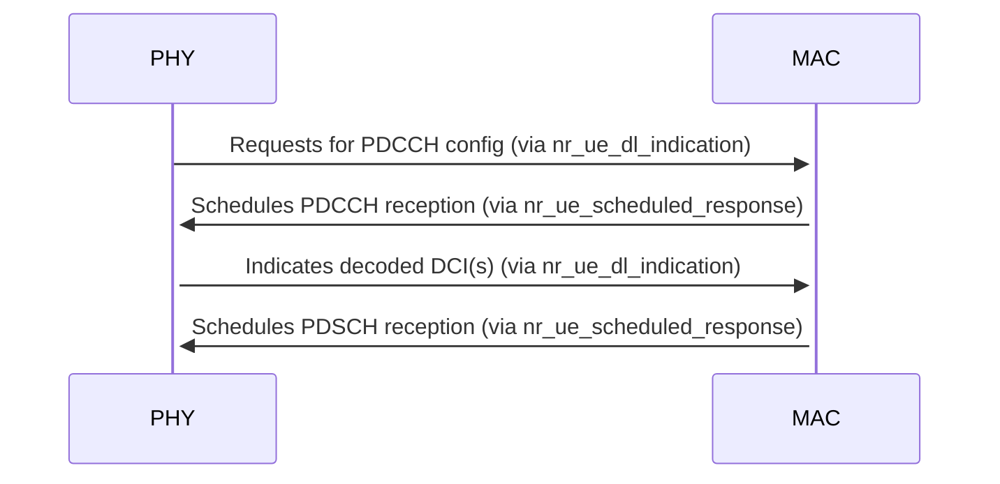
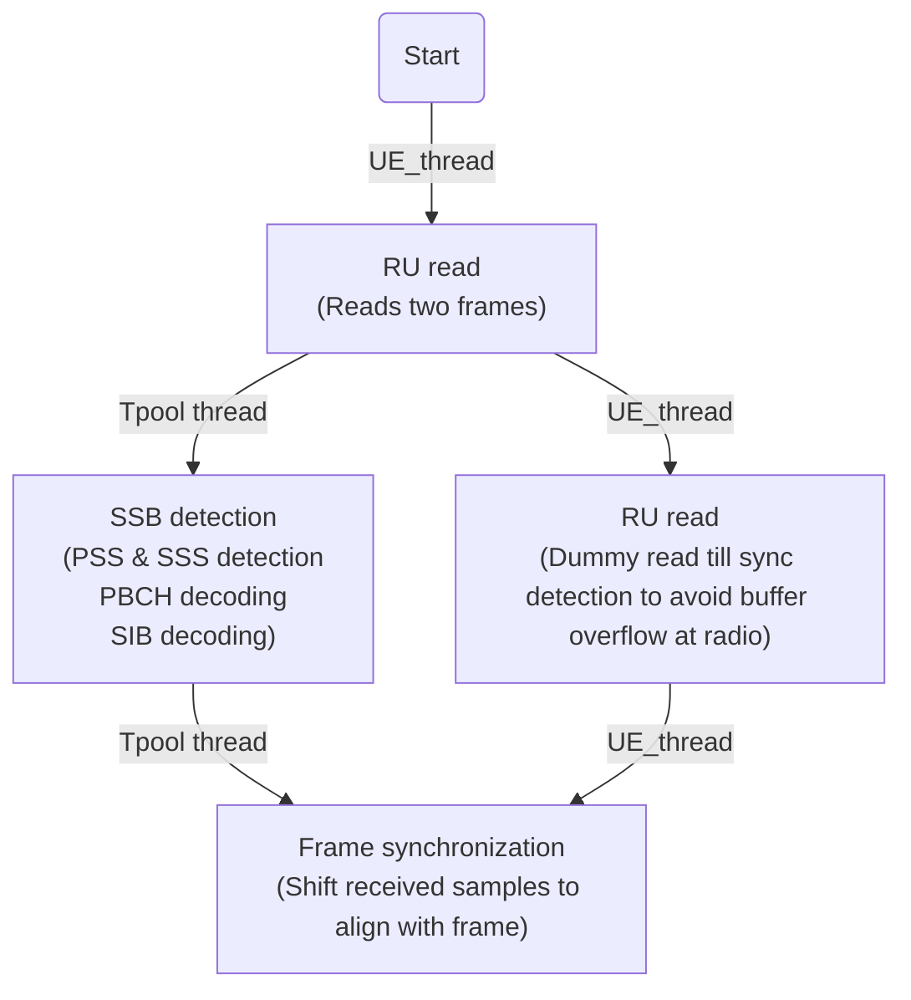
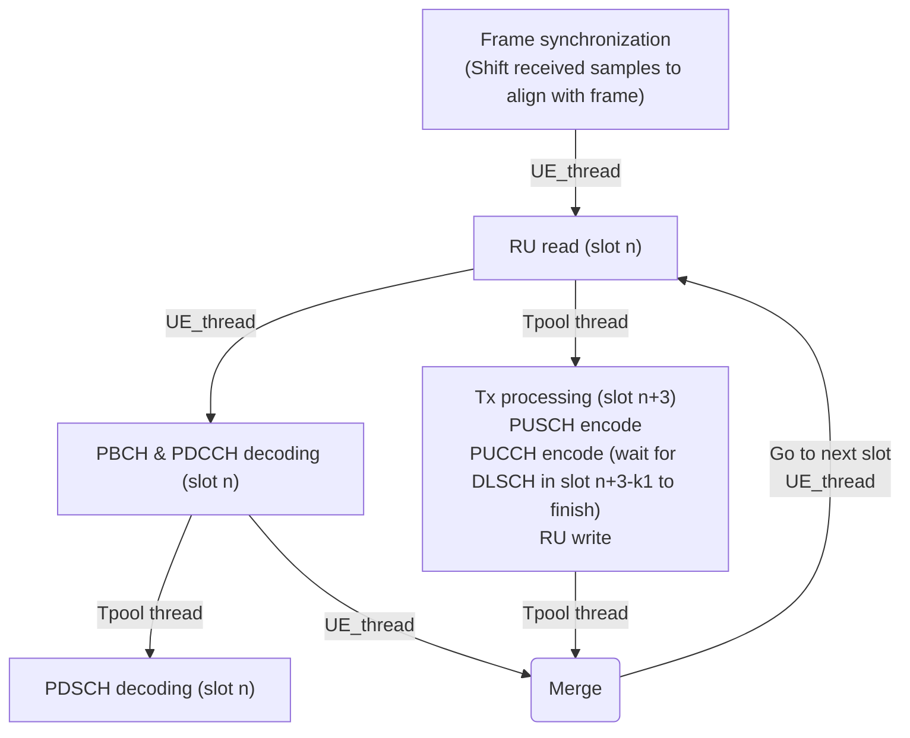
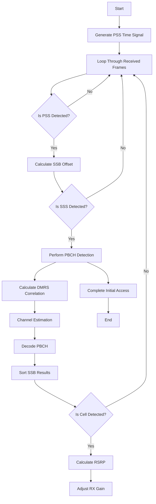
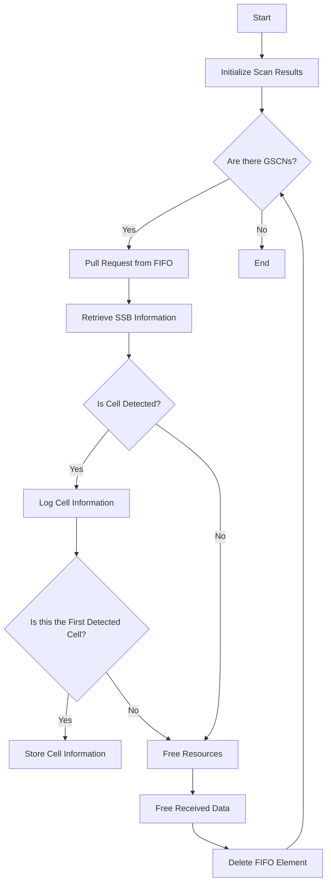

@NTUST
# OAI UE Initial Access Trace Record

:::success
**Introduction：**

This note is used to analyze the OAI UE initial process.

**Goal：**

- [ ] Complete the process of tracking OAI UE's power-on until decoding MIB

**Reference：**
- [Openairinterface5g](https://github.com/OPENAIRINTERFACE/openairinterface5g)
- [5G UE Prototyping based on OpenAirInterface](https://www.openairinterface.org/docs/workshop/1stOAINorthAmericaWorkshop/Talks/WANG-OAI-NORTH-AMERICA-WORKSHOP-TALK.pdf)
- [38.104](https://www.etsi.org/deliver/etsi_ts/138100_138199/138104/16.04.00_60/ts_138104v160400p.pdf)
- [38.211(7.4.2.1)](https://www.etsi.org/deliver/etsi_ts/138200_138299/138211/16.02.00_60/ts_138211v160200p.pdf)
- [38.212(7.3.1.1.1/7.3.1.2.1 Format 0_0/Format 1_0)](https://www.etsi.org/deliver/etsi_ts/138200_138299/138212/16.02.00_60/ts_138212v160200p.pdf)
- [38.213(table 13)](https://www.etsi.org/deliver/etsi_ts/138300_138399/138331/17.01.00_60/ts_138331v170100p.pdf)
- [38.214(5.1.2.1.1)](https://www.etsi.org/deliver/etsi_ts/138200_138299/138214/16.02.00_60/ts_138214v160200p.pdf)
- [38.300(5.2.5.3)](https://www.etsi.org/deliver/etsi_ts/138300_138399/138300/16.04.00_60/ts_138300v160400p.pdf)
- [38.331](https://www.etsi.org/deliver/etsi_ts/138300_138399/138331/17.01.00_60/ts_138331v170100p.pdf)
:::

:::info
[TOC]
:::
## Flow chart



## PHY and MAC Interface
The PHY sends scheduling requests and data indication to MAC via 
- `nr_ue_dl_indication` for DL path
- `nr_ue_ul_indication()` for UL path 
 
And the MAC sends scheduling configuration to PHY via `nr_ue_scheduled_response()`

The following diagram shows the interaction for PDCCH and PDSCH reception




## Initial Synchronization Block




## Regular Slot Processing



## Synchronization on input FH interface
- PATH:`oai_split/openairinterface5g/executables/nr-ru.c`

```c=
    // synchronization on input FH interface, acquire signals/data and block
    LOG_D(PHY,"[RU_thread] read data: frame_rx = %d, tti_rx = %d\n", frame, slot);

    if (ru->fh_south_in) ru->fh_south_in(ru,&frame,&slot);
    else AssertFatal(1==0, "No fronthaul interface at south port");

    if (initial_wait == 1 && proc->frame_rx < 300) {
      if (proc->frame_rx > 0 && ((proc->frame_rx % 100) == 0) && proc->tti_rx == 0) {
        LOG_D(PHY, "delay processing to let RX stream settle, frame %d (trials %d)\n", proc->frame_rx, ru->rx_fhaul.trials);
        print_meas(&ru->rx_fhaul, "rx_fhaul", NULL, NULL);
        reset_meas(&ru->rx_fhaul);
      }
      continue;
    }
    if (proc->frame_rx>=300)  {
      initial_wait = 0;
    }
    if (initial_wait == 0 && ru->rx_fhaul.trials > 1000) {
        reset_meas(&ru->rx_fhaul);
        reset_meas(&ru->tx_fhaul);
    }
    proc->timestamp_tx = proc->timestamp_rx;
    for (int i = proc->tti_rx; i < proc->tti_rx + ru->sl_ahead; i++)
      proc->timestamp_tx += fp->get_samples_per_slot(i % fp->slots_per_frame, fp);
    proc->tti_tx = (proc->tti_rx + ru->sl_ahead) % fp->slots_per_frame;
    proc->frame_tx = proc->tti_rx > proc->tti_tx ? (proc->frame_rx + 1) & 1023 : proc->frame_rx;
    int64_t absslot_rx = proc->timestamp_rx/fp->get_samples_per_slot(proc->tti_rx,fp);
    int rt_prof_idx = absslot_rx % RT_PROF_DEPTH;
    clock_gettime(CLOCK_MONOTONIC,&ru->rt_ru_profiling.return_RU_south_in[rt_prof_idx]);
    LOG_D(PHY,"AFTER fh_south_in - SFN/SL:%d%d RU->proc[RX:%d.%d TX:%d.%d] RC.gNB[0]:[RX:%d%d TX(SFN):%d]\n",
          frame,slot,
          proc->frame_rx,proc->tti_rx,
          proc->frame_tx,proc->tti_tx,
          RC.gNB[0]->proc.frame_rx,RC.gNB[0]->proc.slot_rx,
          RC.gNB[0]->proc.frame_tx);

    if (ru->idx != 0)
      proc->frame_tx = (proc->frame_tx + proc->frame_offset) & 1023;
```

## L1

### gNB
:::spoiler
- `beam_index_allocation`: 
    - 這個函數可能用來為某個時隙分配一個波束索引，涉及到波束成形，通常與5G的MIMO技術相關。
- `nr_common_signal_procedures`: 
    - 這個函數處理gNB的常用訊號過程，例如同步訊號或廣播訊息的處理。
- `clear_slot_beamid`: 
    - 此函數可能用於清除某個時隙相關的波束ID。波束ID是用來識別特定波束的一個標記，可能需要在傳輸過程中進行清理。
- `phy_procedures_gNB_TX`: 
    - 這個函數處理gNB的物理層傳輸過程，包括資料處理、編碼、調變和最終的訊號傳輸。
- `nr_postDecode`: 
    - 此函數可能是解碼後的後處理過程，用於處理gNB接收到的訊號，進行進一步分析和處理。
- `nr_ulsch_procedures`: 
    - 此函數處理上行共享頻道（ULSCH）的過程，涉及上行鏈路的資料傳輸，包括HARQ（混合自動重傳請求）等機制。
- `nr_fill_indication`: 
    - 此函數用於填充指示訊息，可能是用來報告上行共享頻道（ULSCH）處理的結果，如CRC校驗結果和是否有丟包等。
- `fill_srs_reported_symbol_list`: 
    - 此函數涉及SRS符號的報告，可能會根據上行鏈路的訊號品質（如SNR）填入符號列表，用於後續的處理。
- `fill_srs_channel_matrix`: 
    - 此函數用於填充一個矩陣，表示SRS訊號的通道品質估計，涉及不同天線配置和SRS相關的資訊。
- `check_srs_pdu`: 
    - 此函數可能用於檢查SRS PDU（實體資料單元）的有效性，確保其符合預期的格式或標準。
- `phy_procedures_gNB_uespec_RX`: 
    - 這個函數處理gNB在實體層接收到的UE專用訊號或流程，涉及接收、解碼和處理UE（使用者裝置）的訊號。
:::
:::info
- `beam_index_allocation`: 
    -  This function may be used to allocate a beam index for a timeslot, which involves beamforming and is usually related to 5G MIMO technology.
- `nr_common_signal_procedures`: 
    - This function handles common signal procedures of gNB, such as the processing of synchronization signals or broadcast messages.
- `clear_slot_beamid`: 
    - This function may be used to clear the beam ID associated with a time slot. The beam ID is a tag used to identify a specific beam and may need to be cleared during transmission.
- `phy_procedures_gNB_TX`: 
    - This function handles the physical layer transmission process of gNB, including data processing, coding, modulation and final signal transmission.
- `nr_postDecode`: 
    - This function may be a post-processing process after decoding, used to process the signal received by the gNB for further analysis and processing.
- `nr_ulsch_procedures`: 
    - This function handles the uplink shared channel (ULSCH) procedures, involving uplink data transmission, including mechanisms such as HARQ (Hybrid Automatic Repeat Request).
- `nr_fill_indication`: 
    - This function is used to fill the indication message, which may be used to report the results of uplink shared channel (ULSCH) processing, such as CRC check result and whether there is packet loss.
- `fill_srs_reported_symbol_list`: 
    - This function involves reporting of SRS symbols and may fill in the symbol list based on the uplink signal quality (such as SNR) for subsequent processing.
- `fill_srs_channel_matrix`: 
    - This function is used to fill a matrix representing the channel quality estimation of the SRS signal, involving different antenna configurations and SRS-related information.
- `check_srs_pdu`: 
    - This function may be used to check the validity of an SRS PDU (Physical Data Unit), ensuring that it conforms to the expected format or standard.
- `phy_procedures_gNB_uespec_RX`: 
    - This function handles UE-specific signals or procedures received by the gNB at the physical layer, which involves receiving, decoding and processing the signals from the UE (User Equipment).
:::

### UE
:::spoiler
- 初始化狀態相關:
    - `init_NR_UE`：UE實例的主初始化函數
    - `init_nr_ue_vars`: 初始化單一UE的變數
    - `init_NR_UE_threads`：初始化UE相關執行緒
    - `init_nrUE_standalone_thread`：初始化獨立模式UE線程
- 同步與接收處理：
    - `UE_synch`: 處理UE與基地台的同步
    - `syncInFrame`: 在幀內進行同步
    - `nr_ue_adjust_rx_gain`: 調整UE接收增益
    - `readFrame`：讀取接收幀數據
    - `UE_dl_processing`: 下一步鏈路資料處理
    - `UE_dl_preprocessing`: 下一步預處理
- 發送處理:
    - `RU_write`: 射頻單元資料寫入
    - `processSlotTX`: 處理時隙發送
    - `dummyWrite`：模擬資料寫入
- 線程任務:
    - `UE_thread`：UE主執行緒
    - `NRUE_phy_stub_standalone_pnf_task`: 獨立模式物理層存根任務
    - `nrL1_UE_stats_thread`: L1層統計資訊線程
- 輔助功能:
    - `dump_L1_UE_meas_stats`: 匯出L1層測量統計
    - `process_queued_nr_nfapi_msgs`: 處理NFAPI訊息佇列
    - `get_firstSymSamp/get_readBlockSize`：計算符號取樣與讀取區塊大小
:::
:::info
- Initialization status related:
    - `init_NR_UE`: the main initialization function for the UE instance
    - `init_nr_ue_vars`: initialize variables for a single UE
    - `init_NR_UE_threads`: Initialize UE related threads
    - `init_nrUE_standalone_thread`: initializes the standalone mode UE thread
- Synchronization and reception processing:
    - `UE_synch`: handles synchronization between UE and base station
    - `syncInFrame`: synchronize within a frame
    - `nr_ue_adjust_rx_gain`: adjust UE receive gain
    - `readFrame`: read received frame data
    - `UE_dl_processing`: next link data processing
    - `UE_dl_preprocessing`: next step preprocessing
- Sending Process:
     - `RU_write`: RF unit data writing
     - `processSlotTX`: process slot transmission
     - `dummyWrite`: simulate data writing
- Thread Tasks:
     - `UE_thread`: UE main execution thread
     - `NRUE_phy_stub_standalone_pnf_task`: standalone mode physical layer stub task
     - `nrL1_UE_stats_thread`: L1 layer statistics thread
- Accessibility:
     - `dump_L1_UE_meas_stats`: dump L1 layer measurement statistics
     - `process_queued_nr_nfapi_msgs`: process queued NFAPI messages
     - `get_firstSymSamp/get_readBlockSize`: calculate symbol sample and read block size
:::

### RU
:::spoiler
- 配置與初始化
    - `NRRCconfig_RU()`:
        - 根據提供的配置接口，為NRRC（新無線電無線電配置）配置RU。
    - `attach_rru()`:
        - 將遠端射頻單元（RRU）連接到主RU，可能用於分佈式射頻架構中的操作。
    - `init_NR_RU()`:
        - 使用給定的配置和射頻（RF）設置文件初始化RU。
    - `start_NR_RU()`:
        - 啟動RU的進程，準備進入運行狀態。
    - `stop_RU()`:
        - 停止指定數量的RU。
    - `fill_rf_config`:
        - 根據提供的RF配置文件填充RU的配置。
- FH接口
    - FH輸入函數(處理來自南向（面向遠端RU）或北向（面向核心網絡）方向的前傳接口數據流)：
        - fh_if5_south_in 
        - fh_if4p5_south_in 
        - fh_if4p5_south_asynch_in
        - fh_if4p5_north_in 
        - fh_if5_north_asynch_in 
        - fh_if4p5_north_asynch_in
    - FH輸出函數(處理前傳接口的輸出數據流)：
        - fh_if5_south_out / fh_if4p5_south_out
        - fh_if5_north_out / fh_if4p5_north_out
- RF 相關函數
    - `rx_rf()`:
        - 處理特定幀和時隙的RF數據接收。
    - `tx_rf()`:
        - 處理特定幀、時隙和時間戳的RF數據傳輸。
    - `get_gpio_flags()`:
        - 獲取RU的GPIO（通用輸入/輸出）標誌，可能用於信號或硬件狀態控制。
- 進程與線程管理
    - `ru_thread()`:
        - 負責處理RU任務的主線程。
    - `ru_tx_func()`:
        - 專門負責RU傳輸過程的函數。
    - `emulatedRF_thread()`:
        - 模擬RF操作，可能用於測試或開發。
    - `ru_stats_thread()`:
        - 監控並報告與RU運行相關的統計信息。
    - `init_RU_proc()`:
        - 初始化RU的處理鏈，為運行做好準備。
    - `start_RU_proc()`:
        - 啟動RU的處理鏈。
    - `kill_NR_RU_proc()`:
        - 終止特定RU實例的處理鏈。
    
- 緩衝與流管理
    - `setup_RU_buffers()`:
        - 分配並初始化RU運行所需的緩衝區。
    - `start_write_thread()`:
        - 啟動專門的線程，用於將數據寫入緩衝區或前傳接口。
    - `start_streaming()`:
        - 開始通過前傳接口進行數據流傳輸。
- 工具與配置
    - `set_function_spec_param()`:
        - 根據RU的角色（例如集中單元或分佈單元），設置功能特定的參數。
    - `check_capabilities()`
        - 驗證RU是否滿足所需的能力要求。
    - `configure_ru` / `configure_rru`
        - 配置RU和RRU，包括設置它們的運行參數。
:::
:::info
- Configuration and initialization
    - `NRRCconfig_RU()`:
        - Configure the RU for NRRC (New Radio Configuration) according to the provided configuration interface.
    - `attach_rru()`:
        - Connects the Remote Radio Unit (RRU) to the Master RU, possibly for operation in a distributed RF architecture.
    - `init_NR_RU()`:
        - Initializes the RU using the given configuration and radio frequency (RF) settings files.
    - `start_NR_RU()`:
        - Start the RU process and prepare to enter the running state.
    - `stop_RU()`:
        - Stop the specified number of RUs.
    - `fill_rf_config`:
        - Populates the configuration of the RU according to the provided RF profile.
- FH interface
    - FH ==input function== (processing fronthaul interface data flow from southbound (towards remote RU) or northbound (towards core network) direction):
        - fh_if5_south_in
        - fh_if4p5_south_in
        - fh_if4p5_south_asynch_in
        - fh_if4p5_north_in
        - fh_if5_north_asynch_in
        - fh_if4p5_north_asynch_in
    - FH ==output function== (processing the output data stream of the fronthaul interface):
        - fh_if5_south_out / fh_if4p5_south_out
        - fh_if5_north_out / fh_if4p5_north_out
- RF related functions
    - `rx_rf()`:
        - Handles RF data reception for specific frames and time slots.
    - `tx_rf()`:
        - Process RF data transmission with specific frames, time slots and timestamps.
    - `get_gpio_flags()`:
        - Get the GPIO (General Purpose Input/Output) flags of the RU, which may be used for signaling or hardware status control.
- Process and thread management
    - `ru_thread()`:
        - The main thread responsible for processing RU tasks.
    - `ru_tx_func()`:
        - Function specifically responsible for the RU transmission process.
    - `emulatedRF_thread()`:
        - Simulate RF operation, perhaps for testing or development.
    - `ru_stats_thread()`:
        - Monitor and report statistics related to RU operation.
    - `init_RU_proc()`:
        - Initialize the RU's processing chain and prepare it for operation.
    - `start_RU_proc()`:
        - Start the processing chain of RU.
    - `kill_NR_RU_proc()`:
        - Terminates the processing chain for a specific RU instance.
- Buffer and stream management
    - `setup_RU_buffers()`:
        - Allocate and initialize the buffers required for RU operation.
    - `start_write_thread()`:
        - Start a dedicated thread for writing data to the buffer or forwarding interface.
    - `start_streaming()`:
        - Start data streaming over the fronthaul interface.
- Tools and Configuration
    - `set_function_spec_param()`:
        - Depending on the role of the RU (e.g. centralized unit or distributed unit), set function-specific parameters.
    - `check_capabilities()`
        - Verify that the RU meets the required capability requirements.
    - `configure_ru` / `configure_rru`
        - Configure RUs and RRUs, including setting their operating parameters.
:::

## UE Synchronization and reception processing:

Synchronization and initial connection

- SSB Detection: Scans GSCN (Global Synchronization Channel) and successfully decodes at SSB (Synchronization Signal Block) index 0.
- Initial synchronization completed: PBCH (Physical Broadcast Channel) is successfully decoded, and the signal strength RSRP is 51 dB/RE.
    - UE completes synchronization:
        - The measured carrier frequency deviation is 6 Hz.
        - PCI (Physical Cell ID) is 0, successfully entering the synchronization state.
### log
Base on this log form OAI_SIM_UE to trace

```bash=
[PHY]   SSB position provided
[NR_PHY]   Starting sync detection
[PHY]   [UE thread Synch] Running Initial Synch 
[NR_PHY]   Starting cell search with center freq: 3619200000, bandwidth: 106. Scanning for 1 number of GSCN.
[NR_PHY]   Scanning GSCN: 0, with SSB offset: 516, SSB Freq: 0.000000
[PHY]   Initial sync: pbch decoded sucessfully, ssb index 0
[PHY]   pbch rx ok. rsrp:51 dB/RE, adjust_rxgain:-1 dB
[NR_PHY]   Cell Detected with GSCN: 0, SSB SC offset: 516, SSB Ref: 0.000000, PSS Corr peak: 99 dB, PSS Corr Average: 61
[PHY]   [UE0] In synch, rx_offset 430080 samples
[PHY]   [UE 0] Measured Carrier Frequency offset 6 Hz
[PHY]   Initial sync successful, PCI: 0
[PHY]   HW: Configuring channel 0 (rf_chain 0): setting tx_freq 3619200006 Hz, rx_freq 3619200006 Hz, tune_offset 0
[PHY]   Got synch: hw_slot_offset 28, carrier off 6 Hz, rxgain 0.000000 (DL 3619200006.000000 Hz, UL 3619200006.000000 Hz)
[PHY]   UE synchronized! decoded_frame_rx=622 UE->init_sync_frame=1 trashed_frames=234
[PHY]   Resynchronizing RX by 430080 samples
[HW]   received write reorder clear context
[HW]   Gap in writing to USRP: last written 527155199, now 527246559, gap 91360
[NR_RRC]   SIB1 decoded
```

`UE_thread` 是一個為UE實作的主線程，負責：
- 初始化硬體設備並進行必要的配置。
- 處理 UE 的同步，包括==初始同步==和==保持同步==。
- 在同步成功後，執行接收和發送成功的週期性任務。
- 管理時序漂移和傳輸佇列，確保即時通訊。

首先我們透過以下的方式確認同步狀態，當 `UE->is_synchronized` 設為 1，表示 UE 已經完成同步。此時，不需要進一步的初始化操作。由於我們採用RF_SIM，所以不需要另外對RF單位進行預熱
- PATH: `oai_split/openairinterface5g/executables/nr-ue.c`

```c=
  if (get_softmodem_params()->sync_ref && UE->sl_mode == 2) {
    UE->is_synchronized = 1;
  } else {
    //warm up the RF board 
    int64_t tmp;
    for (int i = 0; i < 50; i++)
      readFrame(UE, &tmp, true);
  }
```

:::info
這個部分需要注意，由於我們使用的是`UE->sl_mode == 2`
這部分根據`~/openairinterface5g/executables/softmodem-common.h`中的
`#define CONFIG_HLP_SL_MODE ` 可以得知
```bash=
#define CONFIG_HLP_SL_MODE       "sets the NR sidelink mode (0: not in sidelink mode, 1: in-coverage/gNB, 2: out-of-coverage/no gNB)\n"
```

- 0: not in sidelink mode
    - 當 `sl_mode` 設置為 ==0== 時，表示設備不處於 Sidelink 模式。這通常意味著設備不會使用側鏈通信，而是進行常規的與基站的通信。
- 1: in-coverage/gNB
    - 當 `sl_mode` 設置為 ==1== 時，表示設備處於 Sidelink 模式，並且設備是在基站覆蓋範圍內（即設備與基站之間有連接）。這通常用於在基站覆蓋範圍內進行的側鏈通信。
- 2: out-of-coverage/no gNB
    - 當 `sl_mode` 設置為 ==2== 時，表示設備處於 Sidelink 模式，但設備處於無基站覆蓋的範圍，無法與基站通信。這通常是==設備之間直接進行通信==的情況（例如設備到設備，Device-to-Device，D2D），並且不依賴基站。
:::

在滿足同步的條件後，將對==sync_params.DFN/MIB==進行解碼

- PATH: `oai_split/openairinterface5g/executables/nr-ue.c`
```c=
if (UE->is_synchronized) {
          UE->synch_request.received_synch_request = 0;
          if (UE->sl_mode == 2)
            decoded_frame_rx = UE->SL_UE_PHY_PARAMS.sync_params.DFN;
          else
            decoded_frame_rx = mac->mib_frame;
          LOG_A(PHY,
                "UE synchronized! decoded_frame_rx=%d UE->init_sync_frame=%d trashed_frames=%d\n",
                decoded_frame_rx,
                UE->init_sync_frame,
                trashed_frames);
          // shift the frame index with all the frames we trashed meanwhile we perform the synch search
          decoded_frame_rx = (decoded_frame_rx + UE->init_sync_frame + trashed_frames) % MAX_FRAME_NUMBER;
          syncData_t *syncMsg = (syncData_t *)NotifiedFifoData(res);
          intialSyncOffset = syncMsg->rx_offset;
        }
```
這個環節會得到幾個重要的訊息
- decoded_frame_rx：解碼後接收到的幀數據。
- UE->init_sync_frame：初始化同步幀。
- trashed_frames：丟失的幀數量。

接著確認IQ能正常紀錄後，開始trashed_frames的量進行同步調整
- PATH: `oai_split/openairinterface5g/executables/nr-ue.c`
```c=
        if (IS_SOFTMODEM_IQPLAYER || IS_SOFTMODEM_IQRECORDER) {
          // For IQ recorder-player we force synchronization to happen in 280 ms
          while (trashed_frames != 28) {
            readFrame(UE, &sync_timestamp, true);
            trashed_frames += 2;
          }
        } else {
          readFrame(UE, &sync_timestamp, true);
          trashed_frames += ((UE->sl_mode == 2) ? SL_NR_PSBCH_REPETITION_IN_FRAMES : 2);
        }
        continue;
      }
```
---

- 透過fp指標，將NR_DL_FRAME_PARMS的內容(載波頻率、頻譜資源塊等信息)儲存在UE中。
- 頻譜掃描（UE->UE_scan_carrier 為 true），由於我們使用D2D所以這邊理論上是==false==：
    - 如果 UE 被設置為掃描所有可能的 GSCN（Global Synchronization Channel），則調用 `get_scan_ssb_first_sc` 函數。
    -  該函數計算出該頻帶內所有 GSCN 的信息（syncMsg->gscnInfo），並返回 GSCN 的數量（syncMsg->numGscn）。
- 提供的 SSB 位置（UE->UE_scan_carrier 為 false）：
    - ==SIM_RU+OAIUE==
    - 如果已知 SSB 的位置（同步信號塊），則僅設置第一個 SSB 的子載波位置（ssb_start_subcarrier），並記錄到 syncMsg->gscnInfo。
- PATH: `oai_split/openairinterface5g/executables/nr-ue.c`
```c=
NR_DL_FRAME_PARMS *fp = &UE->frame_parms;
if (UE->UE_scan_carrier) {
    LOG_W(PHY, "UE set to scan all GSCN in current bandwidth\n");
    syncMsg->numGscn = get_scan_ssb_first_sc(fp->dl_CarrierFreq, fp->N_RB_DL, fp->nr_band, fp->numerology_index, syncMsg->gscnInfo);
} else {
    LOG_W(PHY, "SSB position provided\n");
    syncMsg->gscnInfo[0] = (nr_gscn_info_t){.ssbFirstSC = fp->ssb_start_subcarrier};
    syncMsg->numGscn = 1;
}
```

在此之後，將執行一個在初始化過程中，創建了一個調用`UE_synch`的任務
- PATH: `oai_split/openairinterface5g/executables/nr-ue.c`
```c=
notifiedFIFO_elt_t *Msg = newNotifiedFIFO_elt(sizeof(syncData_t), 0, &nf, UE_synch);
```
並且在完成初步同步後執行`UE_synch`
- PATH: `oai_split/openairinterface5g/executables/nr-ue.c`

```c=
pushTpool(&(get_nrUE_params()->Tpool), Msg);
```
```c=
    if (!UE->is_synchronized) {
      readFrame(UE, &sync_timestamp, false);
      notifiedFIFO_elt_t *Msg = newNotifiedFIFO_elt(sizeof(syncData_t), 0, &nf, UE_synch);
      syncData_t *syncMsg = (syncData_t *)NotifiedFifoData(Msg);
      *syncMsg = (syncData_t){0};
      NR_DL_FRAME_PARMS *fp = &UE->frame_parms;
         .
         .
         .
         .
         .
      pushTpool(&(get_nrUE_params()->Tpool), Msg);
      trashed_frames = 0;
      syncRunning = true;
      continue;
    }
```


---
### init_nr_ue_vars
在`init_nr_ue_vars`初始化時 UE->target_Nid_cell = -1

- 在`UE_synch`中， UE->target_Nid_cell 是用來存儲目標小區識別符（Nid_cell）的變量，這通常用來表示用戶設備（UE）要與哪個小區進行同步。
    - 如果 target_Nid_cell 是一個有效的值（即不為 -1），這意味著 UE 已經知道要重新同步的目標小區。
    - 如果 target_Nid_cell 為 -1，則表示沒有指定目標小區，可能是在尋找或進行==初次同步==。

- PATH: `oai_split/openairinterface5g/executables/nr-ue.c`

```c=
  if (UE->target_Nid_cell != -1) {
    LOG_W(NR_PHY, "Starting re-sync detection for target Nid_cell %i\n", UE->target_Nid_cell);
  } else {
    LOG_W(NR_PHY, "Starting sync detection\n");
  }

  LOG_I(PHY, "[UE thread Synch] Running Initial Synch \n");

```
:::danger
根據條件式，不應該執行`nr_initial_sync`，但log卻顯示僅屬於`nr_initial_sync`的log
```c=
  if (UE->sl_mode == 2) {
    fp = &UE->SL_UE_PHY_PARAMS.sl_frame_params;
    dl_carrier = fp->sl_CarrierFreq;
    ul_carrier = fp->sl_CarrierFreq;
    ret = sl_nr_slss_search(UE, &syncD->proc, SL_NR_SSB_REPETITION_IN_FRAMES);
  } else {
    nr_get_carrier_frequencies(UE, &dl_carrier, &ul_carrier);
    ret = nr_initial_sync(&syncD->proc, UE, 2, IS_SA_MODE(get_softmodem_params()), syncD->gscnInfo, syncD->numGscn);
  }
```
:::

```c=
nr_initial_sync_t nr_initial_sync(UE_nr_rxtx_proc_t *proc,
                                  PHY_VARS_NR_UE *ue,
                                  int n_frames,
                                  int sa,
                                  nr_gscn_info_t gscnInfo[MAX_GSCN_BAND],
                                  int numGscn)
{
  NR_DL_FRAME_PARMS *fp = &ue->frame_parms;

  notifiedFIFO_t nf;
  initNotifiedFIFO(&nf);

  ////////////////////////記錄掃描計畫的初始化信息/////////////////////////
  LOG_I(NR_PHY,
        "Starting cell search with center freq: %ld, bandwidth: %d. Scanning for %d number of GSCN.\n",
        fp->dl_CarrierFreq,
        fp->N_RB_DL,
        numGscn);
  
    
    ////////////////////////為每個 GSCN 分配掃描任務////////////////////////
  for (int s = 0; s < numGscn; s++) {
    notifiedFIFO_elt_t *req = newNotifiedFIFO_elt(sizeof(nr_ue_ssb_scan_t), gscnInfo[s].gscn, &nf, &nr_scan_ssb);
    
    ////////////////////////初始化 SSB 掃描結構////////////////////////
    nr_ue_ssb_scan_t *ssbInfo = (nr_ue_ssb_scan_t *)NotifiedFifoData(req);
    *ssbInfo = (nr_ue_ssb_scan_t){.gscnInfo = gscnInfo[s],
                                  .fp = &ue->frame_parms,
                                  .proc = proc,
                                  .syncRes.cell_detected = false,
                                  .nFrames = n_frames,
                                  .foFlag = ue->UE_fo_compensation,
                                  .targetNidCell = ue->target_Nid_cell};
    ////////////////////////分配和初始化 RX 數據緩衝區////////////////////////
    ssbInfo->rxdata = malloc16_clear(fp->nb_antennas_rx * sizeof(c16_t *));
    for (int ant = 0; ant < fp->nb_antennas_rx; ant++) {
      ssbInfo->rxdata[ant] = malloc16(sizeof(c16_t) * (fp->samples_per_frame * 2 + fp->ofdm_symbol_size));
      memcpy(ssbInfo->rxdata[ant], ue->common_vars.rxdata[ant], sizeof(c16_t) * fp->samples_per_frame * 2);
      memset(ssbInfo->rxdata[ant] + fp->samples_per_frame * 2, 0, fp->ofdm_symbol_size * sizeof(c16_t));
    }
    LOG_I(NR_PHY,
          "Scanning GSCN: %d, with SSB offset: %d, SSB Freq: %lf\n",
          ssbInfo->gscnInfo.gscn,
          ssbInfo->gscnInfo.ssbFirstSC,
          ssbInfo->gscnInfo.ssRef);
    pushTpool(&get_nrUE_params()->Tpool, req);
  }

```
- SSB域位置的描述有兩種方式：
    - 絕對頻點號 NARFCN
    - 全球頻同步頻道號碼 GSCN


- 38.104


### nr_scan_ssb
#### Flow chart

#### 細節討論
在此之後，將執行`nr_scan_ssb`

- PSS檢測：定位同步信號PSS的位置。
- SSS檢測：根據PSS確定SS/PBCH塊的位置並進一步確定小區ID。
- PBCH解碼：從PBCH中提取關鍵信息（如系統幀號和同步細節）。
- 頻率補償：補償頻率偏移，確保解碼的準確性。

```c=
void nr_scan_ssb(void *arg)
{
  /*   Initial synchronisation
   *
   *                                 1 radio frame = 10 ms
   *     <--------------------------------------------------------------------------->
   *     -----------------------------------------------------------------------------
   *     |                                 Received UE data buffer                    |
   *     ----------------------------------------------------------------------------
   *                     --------------------------
   *     <-------------->| pss | pbch | sss | pbch |
   *                     --------------------------
   *          sync_pos            SS/PBCH block
   */

  nr_ue_ssb_scan_t *ssbInfo = (nr_ue_ssb_scan_t *)arg;
  c16_t **rxdata = ssbInfo->rxdata;
  const NR_DL_FRAME_PARMS *fp = ssbInfo->fp;

  // Generate PSS time signal for this GSCN.
  __attribute__((aligned(32))) c16_t pssTime[NUMBER_PSS_SEQUENCE][fp->ofdm_symbol_size];
  const int pss_sequence = get_softmodem_params()->sl_mode == 0 ? NUMBER_PSS_SEQUENCE : NUMBER_PSS_SEQUENCE_SL;
  for (int nid2 = 0; nid2 < pss_sequence; nid2++)
    generate_pss_nr_time(fp, nid2, ssbInfo->gscnInfo.ssbFirstSC, pssTime[nid2]);

  // initial sync performed on two successive frames, if pbch passes on first frame, no need to process second frame
  // only one frame is used for simulation tools
  for (int frame_id = 0; frame_id < ssbInfo->nFrames && !ssbInfo->syncRes.cell_detected; frame_id++) {
    /* process pss search on received buffer */
    ssbInfo->syncRes.frame_id = frame_id;
    int nid2;
    int freq_offset_pss = 0;
    const int sync_pos = pss_synchro_nr((const c16_t **)rxdata,
                                        fp,
                                        pssTime,
                                        frame_id,
                                        ssbInfo->foFlag,
                                        ssbInfo->targetNidCell,
                                        &nid2,
                                        &freq_offset_pss,
                                        &ssbInfo->pssCorrPeakPower,
                                        &ssbInfo->pssCorrAvgPower);
    if (sync_pos < fp->nb_prefix_samples)
      continue;

    ssbInfo->ssbOffset = sync_pos - fp->nb_prefix_samples;

#ifdef DEBUG_INITIAL_SYNCH
    LOG_I(PHY, "Initial sync : Estimated PSS position %d, Nid2 %d, ssb offset %d\n", sync_pos, nid2, ssbInfo->ssbOffset);
#endif
    /* check that SSS/PBCH block is continuous inside the received buffer */
    if (ssbInfo->ssbOffset + NR_N_SYMBOLS_SSB * (fp->ofdm_symbol_size + fp->nb_prefix_samples) >= fp->samples_per_frame) {
      LOG_D(PHY, "Can't try to decode SSS from PSS position, will retry (PSS circular buffer wrapping): sync_pos %d\n", sync_pos);
      continue;
    }

    // digital compensation of FFO for SSB symbols
    if (ssbInfo->foFlag) {
      compensate_freq_offset(rxdata, fp, freq_offset_pss, frame_id);
    }

    /* slot_fep function works for lte and takes into account begining of frame with prefix for subframe 0 */
    /* for NR this is not the case but slot_fep is still used for computing FFT of samples */
    /* in order to achieve correct processing for NR prefix samples is forced to 0 and then restored after function call */
    /* symbol number are from beginning of SS/PBCH blocks as below:  */
    /*    Signal            PSS  PBCH  SSS  PBCH                     */
    /*    symbol number      0     1    2    3                       */
    /* time samples in buffer rxdata are used as input of FFT -> FFT results are stored in the frequency buffer rxdataF */
    /* rxdataF stores SS/PBCH from beginning of buffers in the same symbol order as in time domain */

    const uint32_t rxdataF_sz = fp->samples_per_slot_wCP;
    __attribute__((aligned(32))) c16_t rxdataF[fp->nb_antennas_rx][rxdataF_sz];
    for (int i = 0; i < NR_N_SYMBOLS_SSB; i++)
      nr_slot_fep(NULL, fp, 0, i, rxdataF, link_type_dl, frame_id * fp->samples_per_frame + ssbInfo->ssbOffset, (c16_t **)rxdata);

    int freq_offset_sss = 0;
    int32_t metric_tdd_ncp = 0;
    uint8_t phase_tdd_ncp;
    ssbInfo->syncRes.cell_detected = rx_sss_nr(fp,
                                               nid2,
                                               ssbInfo->targetNidCell,
                                               freq_offset_pss,
                                               ssbInfo->gscnInfo.ssbFirstSC,
                                               &ssbInfo->nidCell,
                                               &metric_tdd_ncp,
                                               &phase_tdd_ncp,
                                               &freq_offset_sss,
                                               rxdataF);
#ifdef DEBUG_INITIAL_SYNCH
    LOG_I(PHY,
          "TDD Normal prefix: sss detection result; %d, CellId %d metric %d, phase %d, measured offset %d\n",
          ssbInfo->syncRes.cell_detected,
          ssbInfo->nidCell,
          metric_tdd_ncp,
          phase_tdd_ncp,
          ssbInfo->syncRes.rx_offset);
#endif
    ssbInfo->freqOffset = freq_offset_pss + freq_offset_sss;

    if (ssbInfo->syncRes.cell_detected) { // we got sss channel
      ssbInfo->syncRes.cell_detected = nr_pbch_detection(ssbInfo->proc,
                                                         ssbInfo->fp,
                                                         ssbInfo->nidCell,
                                                         1,
                                                         ssbInfo->gscnInfo.ssbFirstSC,
                                                         &ssbInfo->halfFrameBit,
                                                         &ssbInfo->ssbIndex,
                                                         &ssbInfo->symbolOffset,
                                                         &ssbInfo->pbchResult,
                                                         rxdataF); // start pbch detection at first symbol after pss
      if (ssbInfo->syncRes.cell_detected) {
        int rsrp_db_per_re = nr_ue_calculate_ssb_rsrp(ssbInfo->fp, ssbInfo->proc, rxdataF, 0, ssbInfo->gscnInfo.ssbFirstSC);
        ssbInfo->adjust_rxgain = TARGET_RX_POWER - rsrp_db_per_re;
        LOG_I(PHY, "pbch rx ok. rsrp:%d dB/RE, adjust_rxgain:%d dB\n", rsrp_db_per_re, ssbInfo->adjust_rxgain);
      }
    }
  }

  completed_task_ans(ssbInfo->ans);
}
```
#### PSS檢測
- 根據當前GSCN，為所有可能的`Nid2`生成PSS序列
```c=
  // Generate PSS time signal for this GSCN.
  __attribute__((aligned(32))) c16_t pssTime[NUMBER_PSS_SEQUENCE][fp->ofdm_symbol_size];
  const int pss_sequence = get_softmodem_params()->sl_mode == 0 ? NUMBER_PSS_SEQUENCE : NUMBER_PSS_SEQUENCE_SL;
  for (int nid2 = 0; nid2 < pss_sequence; nid2++)
    generate_pss_nr_time(fp, nid2, ssbInfo->gscnInfo.ssbFirstSC, pssTime[nid2]);

```
- 逐幀搜索PSS、頻率偏移補償
- 如果啟用了頻率偏移補償（foFlag），調用 compensate_freq_offset 進行修正。
- 調用  `pss_synchro_nr` 確定PSS位置、`Nid2（同步信號索引）`和頻率偏移。
- 如果PSS位置異常或緩衝區不連續，跳過當前幀。
```c=
    const int sync_pos = pss_synchro_nr((const c16_t **)rxdata,
                                        fp,
                                        pssTime,
                                        frame_id,
                                        ssbInfo->foFlag,
                                        ssbInfo->targetNidCell,
                                        &nid2,
                                        &freq_offset_pss,
                                        &ssbInfo->pssCorrPeakPower,
                                        &ssbInfo->pssCorrAvgPower);
    if (sync_pos < fp->nb_prefix_samples)
      continue;

    ssbInfo->ssbOffset = sync_pos - fp->nb_prefix_samples;
```
#### SSS檢測
- SSS檢測

基於PSS位置，調用 rx_sss_nr 確定小區ID (nidCell)、頻率偏移和同步結果。
```c=
    ssbInfo->syncRes.cell_detected = rx_sss_nr(fp,
                                               nid2,
                                               ssbInfo->targetNidCell,
                                               freq_offset_pss,
                                               ssbInfo->gscnInfo.ssbFirstSC,
                                               &ssbInfo->nidCell,
                                               &metric_tdd_ncp,
                                               &phase_tdd_ncp,
                                               &freq_offset_sss,
                                               rxdataF);
```

#### PBCH解碼
- 調用 `nr_pbch_detection` 解碼PBCH。
- 如果解碼成功，計算RSRP（接收信號功率）並調整接收增益。
```c=
 ssbInfo->syncRes.cell_detected = nr_pbch_detection(ssbInfo->proc,
                                                         ssbInfo->fp,
                                                         ssbInfo->nidCell,
                                                         1,
                                                         ssbInfo->gscnInfo.ssbFirstSC,
                                                         &ssbInfo->halfFrameBit,
                                                         &ssbInfo->ssbIndex,
                                                         &ssbInfo->symbolOffset,
                                                         &ssbInfo->pbchResult,
                                                         rxdataF); // start pbch detection at first symbol after pss

if (ssbInfo->syncRes.cell_detected) {
        int rsrp_db_per_re = nr_ue_calculate_ssb_rsrp(ssbInfo->fp, ssbInfo->proc, rxdataF, 0, ssbInfo->gscnInfo.ssbFirstSC);
        ssbInfo->adjust_rxgain = TARGET_RX_POWER - rsrp_db_per_re;
        LOG_I(PHY, "pbch rx ok. rsrp:%d dB/RE, adjust_rxgain:%d dB\n", rsrp_db_per_re, ssbInfo->adjust_rxgain);
      }

```
- `nr_pbch_detection` 中有些L1的重要過程需要留意
    - `nr_pbch_dmrs_correlation` : 計算接收到的DMRS信號與理論序列之間的相關性，用於評估SSB的信號質量。
    - `nr_pbch_channel_estimation` : 進行頻域的信道估計，基於PBCH的DMRS符號計算信道響應。
    - `nr_rx_pbch` : 對PBCH進行解碼，提取關鍵信息，如系統幀號、半幀位等。
    - `qsort` : 用於根據 metric 對SSB結果進行排序，確保選擇最佳的SSB進行進一步處理。
- `ssbInfo->syncRes.cell_detected` 表示是否檢測到小區，透過`nr_ue_calculate_ssb_rsrp` 開始計算RSRP，計算當前訊號強度`rsrp_db_per_re`，並根據`TARGET_RX_POWER` 進行 `adjust_rxgain` 的計算


### nr_initial_sync
#### Collect the scan results


```c=
// Collect the scan results
  nr_ue_ssb_scan_t res = {0};
  while (numGscn) {
    notifiedFIFO_elt_t *req = pullTpool(&nf, &get_nrUE_params()->Tpool);
    nr_ue_ssb_scan_t *ssbInfo = (nr_ue_ssb_scan_t *)NotifiedFifoData(req);
    if (ssbInfo->syncRes.cell_detected) {
      LOG_A(NR_PHY,
            "Cell Detected with GSCN: %d, SSB SC offset: %d, SSB Ref: %lf, PSS Corr peak: %d dB, PSS Corr Average: %d\n",
            ssbInfo->gscnInfo.gscn,
            ssbInfo->gscnInfo.ssbFirstSC,
            ssbInfo->gscnInfo.ssRef,
            ssbInfo->pssCorrPeakPower,
            ssbInfo->pssCorrAvgPower);
      if (!res.syncRes.cell_detected) { // take the first cell detected
        res = *ssbInfo;
      }
    }
    for (int ant = 0; ant < fp->nb_antennas_rx; ant++) {
      free(ssbInfo->rxdata[ant]);
    }
    free(ssbInfo->rxdata);
    delNotifiedFIFO_elt(req);
    numGscn--;
  }
```