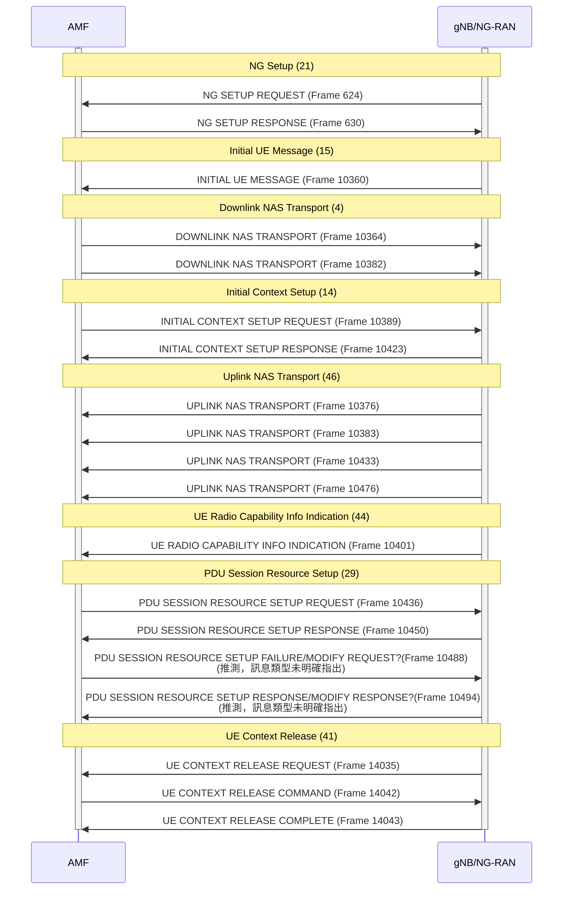

[TOC]
## 程式碼
:::spoiler 用於分析PCAP的程式碼
```python=
import pyshark
from collections import defaultdict
import google.generativeai as genai
import textwrap
import os

# 設定你的 Gemini API Key
GEMINI_API_KEY = os.getenv("GEMINI_API_KEY")
genai.configure(api_key=GEMINI_API_KEY)
MAX_TOKENS = 8000  # 根據 Gemini API 限制設置

def truncate_text(text, max_length=8000):
    wrapped_text = textwrap.wrap(text, width=400)  # 400 characters per segment
    truncated_text = "\n".join(wrapped_text[: max_length // 400])  # 確保完整性
    return truncated_text


def extract_ngap_pdu_summary(pcap_file, output_txt_1, output_txt_2):
    """
    解析 PCAP 檔案，過濾 NGAP 封包，提取完整 NGAP-PDU 結構，並彙總 NGAP 程序流程。

    :param pcap_file: 輸入的 PCAP 檔案
    :param output_txt: 輸出的 TXT 檔案
    """
    packets_data = []
    ngap_summary = defaultdict(list)  # 儲存 Frame ID 與 NGAP 程序的對應關係

    # 過濾 NGAP 封包
    cap = pyshark.FileCapture(pcap_file, display_filter="ngap")

    for pkt in cap:
        try:
            # 提取基本封包資訊
            frame_id = pkt.number if hasattr(pkt, 'number') else 'N/A'
            source_ip = pkt.ip.src if hasattr(pkt, 'ip') else 'N/A'
            dest_ip = pkt.ip.dst if hasattr(pkt, 'ip') else 'N/A'
            length = pkt.length if hasattr(pkt, 'length') else 'N/A'
            # 基本封包資訊
            packet_info = f"Frame {frame_id}\n"
            packet_info += f"Captured Length: {length} bytes\n"
            packet_info += f"Source IP: {source_ip}\n"
            packet_info += f"Destination IP: {dest_ip}\n"
            packet_info += f"Protocol: NG Application Protocol\n"

            # 嘗試提取 procedureCode
            procedure_code = "Unknown ProcedureCode"
            if hasattr(pkt, 'ngap'):
                if hasattr(pkt.ngap, 'procedureCode'):
                    procedure_code = pkt.ngap.procedureCode.showname
                    ngap_summary[procedure_code].append(frame_id)  # 儲存 Frame 與程序對應

            packet_info += f"NGAP procedureCode: {procedure_code}\n"

            # 提取 NGAP-PDU 詳細內容
            ngap_pdu_details = "No NGAP-PDU Details Available"
            if hasattr(pkt, 'ngap'):
                try:
                    ngap_pdu_details = {field: pkt.ngap.get(field, "N/A") for field in pkt.ngap._all_fields}
                except AttributeError:
                    ngap_pdu_details = {"Error": "無法提取 NGAP-PDU 詳細內容"}


            packet_info += f"NGAP-PDU Details:\n"
            for field, value in ngap_pdu_details.items():
                packet_info += f"{field}: {value}\n"

            packet_info += "-" * 100 + "\n"  # 分隔每個封包

            packets_data.append(packet_info)

        except Exception as e:
            print(f"Error processing packet: {e}")

    cap.close()

    # 生成 NGAP 程序總結
    summary_text = "\n\n=== NGAP 程序總結 ===\n"
    summary_text += "根據提供的 NGAP 訊息序列，以下是主要的 NGAP 程序流程：\n\n"

    for procedure, frames in sorted(ngap_summary.items(), key=lambda x: min(map(int, x[1]))):
        frame_list = ", ".join(frames)
        summary_text += f"* 幀 {frame_list}：{procedure} 程序\n"

    # 存成 TXT
    with open(output_txt_1, "w", encoding="utf-8") as f:
        f.write("\n".join(packets_data) + summary_text)
    print(f"Filtered NGAP-PDU details and summary saved to {output_txt_1}")
    with open(output_txt_2, "w", encoding="utf-8") as f:
            f.write("\n"+summary_text)
    print(f"Filtered NGAP-PDU summary saved to {output_txt_2}")

# 使用範例
pcap_file = "sample_e2e.pcap"  # 替換成你的 PCAP 檔案
output_txt_1 = "ngap_pdu_detial.txt"
output_txt_2 = "ngap_pdu_summary.txt"
output_txt_3 = "response1.md"
output_txt_4 = "response2.md"

extract_ngap_pdu_summary(pcap_file, output_txt_1, output_txt_2)

# 發送請求給 Gemini
model = genai.GenerativeModel("models/gemini-1.5-pro-latest")

with open(output_txt_1, "r", encoding="utf-8") as f:
    ngap_details_text = f.read()

with open(output_txt_2, "r", encoding="utf-8") as f:
    ngap_summary_text = f.read()

response1 = model.generate_content(
    f"請分析以下 NGAP 訊息，找出潛在異常，並以 Markdown 格式輸出（使用標題與表格整理），並總結目前狀態是否有重大問題：\n\n{truncate_text(ngap_details_text)}"
)
response2 = model.generate_content(
    f"請分析以下 NGAP 訊息的時序模式，並描述完整交互流程，請輸出成時序圖表建議（Markdown 表格），並總結目前狀態是否有重大問題：\n\n{truncate_text(ngap_summary_text)}"
)

# 儲存 Gemini API 的輸出
with open(output_txt_3, "w", encoding="utf-8") as f:
    f.write(response1.text)
print(f"NGAP 異常分析結果已儲存至 {output_txt_3}")

with open(output_txt_4, "w", encoding="utf-8") as f:
    f.write(response2.text)
print(f"NGAP 時序分析結果已儲存至 {output_txt_4}")
```
:::


:::spoiler 封包總結
```python=

=== NGAP 程序總結 ===
根據提供的 NGAP 訊息序列，以下是主要的 NGAP 程序流程：

* 幀 624, 630：procedureCode: id-NGSetup (21) 程序
* 幀 10360：procedureCode: id-InitialUEMessage (15) 程序
* 幀 10364, 10382：procedureCode: id-DownlinkNASTransport (4) 程序
* 幀 10376, 10383, 10433, 10476：procedureCode: id-UplinkNASTransport (46) 程序
* 幀 10389, 10423：procedureCode: id-InitialContextSetup (14) 程序
* 幀 10401：procedureCode: id-UERadioCapabilityInfoIndication (44) 程序
* 幀 10436, 10450, 10488, 10494：procedureCode: id-PDUSessionResourceSetup (29) 程序
* 幀 14035：procedureCode: id-UEContextReleaseRequest (42) 程序
* 幀 14042, 14043：procedureCode: id-UEContextRelease (41) 程序

```
:::

:::spoiler 分析(1)


```markdown=
## NGAP 訊息分析

此訊息序列顯示了一個 UE 連接到 5G 網路的過程，包含 NG Setup, Initial UE Message, Downlink NAS Transport, 以及 Uplink NAS Transport 等程序。目前看來沒有明顯的重大問題，流程正常。以下表格總結了每個訊息的關鍵資訊：

| Frame | Source IP | Destination IP | Procedure Code |  訊息類型 | 關鍵資訊 |
|---|---|---|---|---|---|
| 624 | 192.168.8.43 (gNB) | 192.168.8.21 (AMF) | NGSetup (21) | NGSetupRequest | gNB 向 AMF 發送 NG Setup Request，包含 gNB ID, RAN Node Name, Supported TA List 等資訊。 |
| 630 | 192.168.8.21 (AMF) | 192.168.8.43 (gNB) | NGSetup (21) | NGSetupResponse | AMF 回應 gNB 的 NG Setup Request，包含 AMF Name, Served GUAMI List, PLMN Support List 等資訊。 |
| 10360 | 192.168.8.43 (gNB) | 192.168.8.21 (AMF) | InitialUEMessage (15) | InitialUEMessage | gNB 將 UE 的初始訊息轉發給 AMF，包含 RAN-UE-NGAP-ID, NAS-PDU (Registration Request), User Location Information 等。 |
| 10364 | 192.168.8.21 (AMF) | 192.168.8.43 (gNB) | DownlinkNASTransport (4) | DownlinkNASTransport | AMF 向 gNB 發送下行 NAS 訊息，包含 AMF-UE-NGAP-ID, RAN-UE-NGAP-ID, NAS-PDU (Authentication Request)。 |
| 10376 | 192.168.8.43 (gNB) | 192.168.8.21 (AMF) | UplinkNASTransport (46) | UplinkNASTransport | gNB 將 UE 的上行 NAS 訊息轉發給 AMF，包含 AMF-UE-NGAP-ID, RAN-UE-NGAP-ID, NAS-PDU (Authentication Response)。 |


## 狀態總結

從目前的訊息序列來看，UE 的連接流程正在正常進行。gNB 和 AMF 之間的 NG Setup 過程成功完成，並且 UE 的初始訊息、驗證請求和驗證回應都已成功傳輸。 訊息中包含了必要的資訊，例如 gNB ID、AMF Name、UE 的位置資訊、NAS 訊息等。  沒有觀察到錯誤訊息或是異常的 Procedure Code。

**然而，這只是連接過程的一部分，需要繼續觀察後續訊息，例如 Security Mode Command, Security Mode Complete, Registration Complete 等，才能確認 UE 是否成功註冊到網路。**  此外，也需要關注是否有任何錯誤訊息或超時情況出現。


建議持續監控後續的 NGAP 訊息，以確保整個連接和註冊過程順利完成。

```
:::

:::spoiler 分析(2)
```markdown=
| 幀號 | Procedure Code | 訊息方向 | 程序名稱 |  說明 |
|---|---|---|---|---|
| 624 | 21 | gNB/NG-RAN -> AMF | NG Setup | NG-RAN 向 AMF 發起連接 |
| 630 | 21 | AMF -> gNB/NG-RAN | NG Setup | AMF 接受 NG-RAN 的連接請求 |
| 10360 | 15 | gNB/NG-RAN -> AMF | Initial UE Message | NG-RAN 將初始 UE 訊息發送給 AMF |
| 10364 | 4 | AMF -> gNB/NG-RAN | Downlink NAS Transport | AMF 向 UE 發送 NAS 訊息 |
| 10376 | 46 | gNB/NG-RAN -> AMF | Uplink NAS Transport | UE 向 AMF 發送 NAS 訊息 |
| 10382 | 4 | AMF -> gNB/NG-RAN | Downlink NAS Transport | AMF 向 UE 發送 NAS 訊息 |
| 10383 | 46 | gNB/NG-RAN -> AMF | Uplink NAS Transport | UE 向 AMF 發送 NAS 訊息 |
| 10389 | 14 | AMF -> gNB/NG-RAN | Initial Context Setup | AMF 请求建立 UE 上下文 |
| 10401 | 44 | gNB/NG-RAN -> AMF | UE Radio Capability Info Indication |  gNB/NG-RAN 向 AMF 提供 UE 的無線電能力信息 |
| 10423 | 14 | gNB/NG-RAN -> AMF | Initial Context Setup | gNB/NG-RAN 響應 AMF 的上下文建立請求 |
| 10433 | 46 | gNB/NG-RAN -> AMF | Uplink NAS Transport | UE 向 AMF 發送 NAS 訊息 |
| 10436 | 29 | AMF -> gNB/NG-RAN | PDU Session Resource Setup | AMF 请求建立 PDU Session 资源 |
| 10450 | 29 | gNB/NG-RAN -> AMF | PDU Session Resource Setup | gNB/NG-RAN 響應 AMF 的 PDU Session 建立請求 |
| 10476 | 46 | gNB/NG-RAN -> AMF | Uplink NAS Transport | UE 向 AMF 發送 NAS 訊息 |
| 10488 | 29 | AMF -> gNB/NG-RAN | PDU Session Resource Setup (推測) |  可能為 PDU Session 建立失敗或修改請求，訊息類型未明確指出。需要進一步確認。|
| 10494 | 29 | gNB/NG-RAN -> AMF | PDU Session Resource Setup (推測) | 可能為 PDU Session 建立響應或修改響應，訊息類型未明確指出。需要進一步確認。|
| 14035 | 42 | gNB/NG-RAN -> AMF | UE Context Release Request | gNB/NG-RAN 请求釋放 UE 上下文 |
| 14042 | 41 | AMF -> gNB/NG-RAN | UE Context Release Command | AMF 命令 gNB/NG-RAN 釋放 UE 上下文 |
| 14043 | 41 | gNB/NG-RAN -> AMF | UE Context Release Complete | gNB/NG-RAN 完成 UE 上下文釋放 |


**目前狀態總結及問題：**

流程看起來大致正常，涵蓋了從 NG Setup 到 UE Context Release 的完整流程。 然而，PDU Session Resource Setup 階段的幀 10488 和 10494 的訊息類型並未明確指出，僅知道 procedureCode 是 29。這可能表示 PDU Session 建立過程中出現了問題，例如建立失敗後需要重新發送請求，或是需要修改資源配置。  **需要進一步確認這兩個幀的具體訊息類型才能判斷是否存在重大問題。**  如果確認是 FAILURE 訊息，則需要分析失敗原因。 如果是 MODIFY  訊息，則需要分析修改的原因。


另外，有多個 Uplink/Downlink NAS Transport 訊息穿插在其他過程中，這點本身沒有問題，因為 NAS 訊息的傳輸可以异步进行。 但需要結合 NAS 訊息的内容才能理解其作用和目的。

```
:::


## 5G NGAP PCAP 解析與 Gemini API 分析

本程式負責解析 **5G NGAP (Next Generation Application Protocol) 封包**，提取關鍵資訊，並使用 **Google Gemini API** 進行異常分析與時序模式分析。

---

## 1. 載入必要的套件
```python=
import pyshark
from collections import defaultdict
import google.generativeai as genai
import textwrap
import os
```
:::info
- `pyshark`：用於解析 PCAP (Packet Capture) 檔案。
- `defaultdict`：用於存儲 NGAP 程序對應的 Frame ID。
- `google.generativeai (genai)`：與 Google Gemini API 交互，分析 NGAP 訊息。
- `textwrap`：處理長文本，確保符合 Gemini API 限制。
- `os`：讀取環境變數中的 API Key。
:::
---

## 2. 設定 Gemini API

```python=
GEMINI_API_KEY = os.getenv("GEMINI_API_KEY")
genai.configure(api_key=GEMINI_API_KEY)
MAX_TOKENS = 8000  # 設定 API Token 限制
```
:::info

- `os.getenv("GEMINI_API_KEY")``：從系統環境變數讀取 API Key，避免硬編碼金鑰，提高安全性。
- `genai.configure(api_key=GEMINI_API_KEY)`：將 API Key 設定到 genai 以進行 API 請求。
- `MAX_TOKENS` = 8000：設定 Gemini API 最多可使用的 Token 數量，確保不超過限制。
:::
---

## 3. 定義 truncate_text() 來處理長文本
```python=
def truncate_text(text, max_length=8000):
    wrapped_text = textwrap.wrap(text, width=400)  # 400 characters per segment
    truncated_text = "\n".join(wrapped_text[: max_length // 400])  # 確保完整性
    return truncated_text
```
:::info

- `textwrap.wrap(text, width=400)`：將長文本分成每段 400 個字元的塊，確保易於處理。
- `truncated_text` = "\n".join(wrapped_text[: max_length // 400])：
    - 限制最大長度為 max_length（8000）。
    - 取前 max_length // 400 段，確保符合 Gemini API 限制。
    - 避免 API 請求過長導致錯誤。
:::
---

## 4. extract_ngap_pdu_summary()：解析 PCAP，提取 NGAP 訊息
```python=
def extract_ngap_pdu_summary(pcap_file, output_txt_1, output_txt_2):
```
:::info

- 解析 pcap_file（PCAP 檔案）。
- 過濾 NGAP 封包並提取關鍵資訊，如 Frame ID、來源與目的 IP、封包長度、procedureCode 及 NGAP-PDU 詳細內容。
- 產生 NGAP 程序流程摘要並存入 output_txt_1（詳細資料）和 output_txt_2（摘要）。
:::
---
### 4.1 建立 packets_data 及 ngap_summary
```python=
packets_data = []
ngap_summary = defaultdict(list)  # 儲存 Frame ID 與 NGAP 程序的對應關係
```
:::info

- `packets_data`：存儲所有 `NGAP-PDU` 詳細資訊。
- `ngap_summary`：使用 `defaultdict` 存儲 `NGAP` 程序對應的 `Frame ID`。
:::
### 4.2 讀取 PCAP，過濾 NGAP 封包
```python=
cap = pyshark.FileCapture(pcap_file, display_filter="ngap")
```
:::info

- 使用 `pyshark.FileCapture()` 讀取 `pcap_file`，並使用 display_filter="ngap" 只篩選 NGAP 封包，避免處理不相關的封包。
:::
### 4.3 遍歷封包，提取關鍵資訊
```python=
for pkt in cap:
    try:
        frame_id = pkt.number if hasattr(pkt, 'number') else 'N/A'
        source_ip = pkt.ip.src if hasattr(pkt, 'ip') else 'N/A'
        dest_ip = pkt.ip.dst if hasattr(pkt, 'ip') else 'N/A'
        length = pkt.length if hasattr(pkt, 'length') else 'N/A'
```
:::info

- 依序提取封包的：
    - frame_id（封包編號）
    - source_ip（來源 IP）
    - dest_ip（目的 IP）
    - length（封包長度）
:::
---
### 4.4 提取 procedureCode

```python=
procedure_code = "Unknown ProcedureCode"
if hasattr(pkt, 'ngap'):
    if hasattr(pkt.ngap, 'procedureCode'):
        procedure_code = pkt.ngap.procedureCode.showname
        ngap_summary[procedure_code].append(frame_id)  # 儲存 Frame 與程序對應
```
:::info

- 若封包內含 `ngap` 屬性，則嘗試提取 `procedureCode`，用於標記 NGAP 事件類型。
:::
---

### 4.5 提取 NGAP-PDU 詳細內容
```python=
ngap_pdu_details = "No NGAP-PDU Details Available"
if hasattr(pkt, 'ngap'):
    try:
        ngap_pdu_details = {field: pkt.ngap.get(field, "N/A") for field in pkt.ngap._all_fields}
    except AttributeError:
        ngap_pdu_details = {"Error": "無法提取 NGAP-PDU 詳細內容"}
```
:::info

- 獲取 `NGAP-PDU` 內的所有欄位，若發生錯誤則回傳錯誤訊息。
:::
---
### 4.6 存儲封包資料
```python=
with open(output_txt_1, "w", encoding="utf-8") as f:
    f.write("\n".join(packets_data) + summary_text)
```
:::info

- 將 `packets_data` 和 `summary_text` 存入 `output_txt_1（完整詳細內容）`。
:::
---
## 5. 讀取已解析的 NGAP 資訊，並發送請求至 Gemini
```python=
with open(output_txt_1, "r", encoding="utf-8") as f:
    ngap_details_text = f.read()

with open(output_txt_2, "r", encoding="utf-8") as f:
    ngap_summary_text = f.read()
```
:::info
- 讀取 `output_txt_1` 和 `output_txt_2` 內容，準備發送給 `Gemini API` 進行分析。
:::
## 6. 使用 Gemini API 進行 NGAP 分析並儲存 Gemini API 的回應
```python=
response1 = model.generate_content(
    f"請分析以下 NGAP 訊息，找出潛在異常，並以 Markdown 格式輸出（使用標題與表格整理），並總結目前狀態是否有重大問題：\n\n{truncate_text(ngap_details_text)}"
)

response2 = model.generate_content(
    f"請分析以下 NGAP 訊息的時序模式，並描述完整交互流程，請輸出成時序圖表建議（Markdown 表格），並總結目前狀態是否有重大問題：\n\n{truncate_text(ngap_summary_text)}"
)

with open(output_txt_3, "w", encoding="utf-8") as f:
    f.write(response1.text)

with open(output_txt_4, "w", encoding="utf-8") as f:
    f.write(response2.text)
```
:::info

- `response1`：分析 NGAP 封包，找出潛在異常。
- `response2`：分析 NGAP 時序模式，提供時序圖表建議。
- `output_txt_3` 存儲異常分析 (response1)。
- `output_txt_4` 存儲時序分析 (response2)。
:::